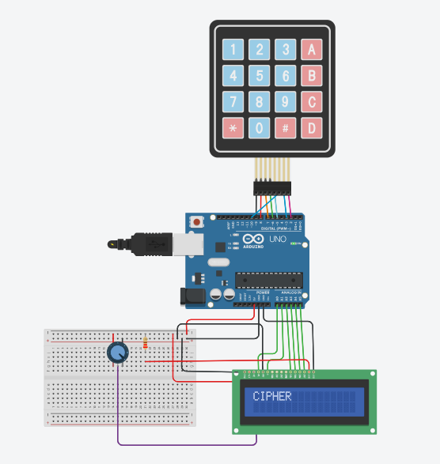

# Keypad and LCD Cipher Project

This Arduino project utilizes a 4x4 matrix keypad and a LiquidCrystal display to create a simple cipher system. Users can input strings via the keypad, and the system will display the string on the LCD. Additionally, the project includes options for encoding and decoding strings using hexadecimal and decimal conversions, as well as simple encryption and decryption.





## Components Used

- Arduino board (e.g., Arduino Uno)
- 4x4 matrix keypad
- LiquidCrystal display
- Connecting wires
- Breadboard

## Libraries Required

- [Keypad](https://playground.arduino.cc/Code/Keypad)
- [LiquidCrystal](https://www.arduino.cc/en/Reference/LiquidCrystal)

## Circuit Diagram

Connect the components as follows:

### Keypad

- Row pins: Connect to Arduino digital pins 9, 8, 7, 6
- Column pins: Connect to Arduino digital pins 5, 10, 3, 2

### LCD

- RS: A0
- E: A1
- D4: A2
- D5: A3
- D6: A4
- D7: A5

## Installation

1. **Download the Arduino IDE**:
   - Ensure you have the Arduino IDE installed on your computer. You can download it from [here](https://www.arduino.cc/en/software).

2. **Clone this Repository**:
   ```bash
   git clone https://github.com/vishal-git21/KeypadLCDCipher.git
   ```

3. **Open the Project**:
   - Open the Arduino IDE.
   - Go to `File` > `Open` and navigate to the `KeypadLCDCipher` folder.
   - Open the `KeypadLCDCipher.ino` file.

4. **Install Required Libraries**:
   - In the Arduino IDE, go to `Sketch` > `Include Library` > `Manage Libraries`.
   - Search for and install the `Keypad` and `LiquidCrystal` libraries.

5. **Upload the Code**:
   - Connect your Arduino board to your computer via USB.
   - Select your Arduino board and port from the `Tools` menu.
   - Click the upload button (right arrow icon) to compile and upload the code to your Arduino board.

## Usage

1. **Power the Arduino Board**:
   - Connect your Arduino board to a power source (e.g., USB or external power supply).

2. **Enter String via Keypad**:
   - Use the keypad to input a string. The string will be displayed on the LCD.

3. **Complete Input**:
   - Press `#` on the keypad to indicate you are done entering the string. The entered string will be displayed on the LCD.

4. **Reset Input**:
   - Press `*` on the keypad to reset the input process and start over.

5. **Options Menu**:
   - After entering the string, follow the prompts on the LCD to select encoding, decoding, encryption, or decryption options.

## Functions

- **encode(String text)**: Converts a hexadecimal string to a decimal value and displays it on the LCD.
- **decode(String text)**: Converts a decimal value to a hexadecimal string and displays it on the LCD.
- **encrypt(String text)**: Encrypts the input string with a simple shift cipher and displays the result on the LCD.
- **decrypt(String text)**: Decrypts the input string with a simple shift cipher and displays the result on the LCD.

